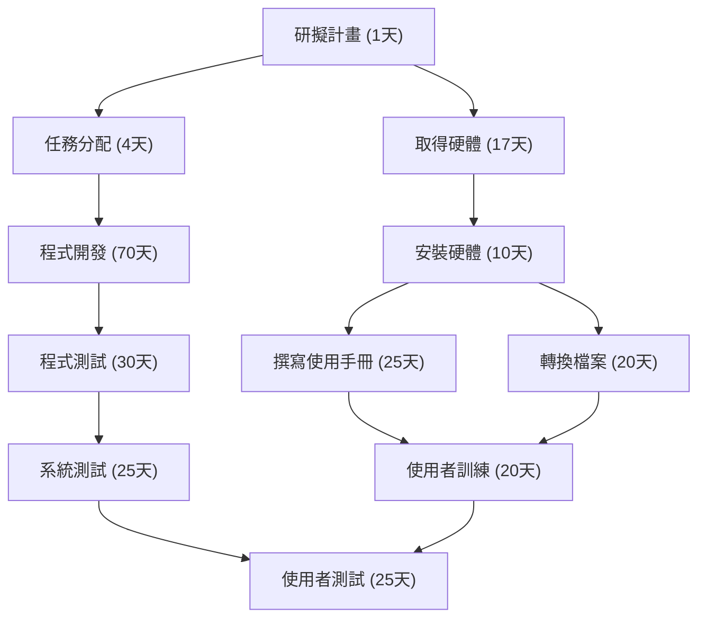
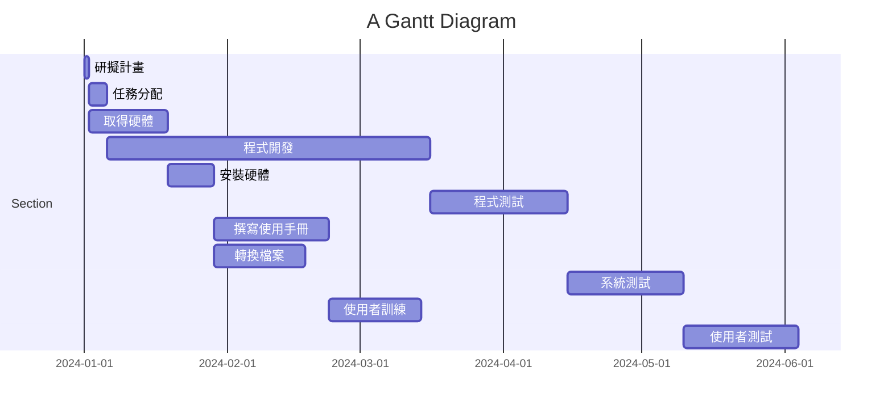
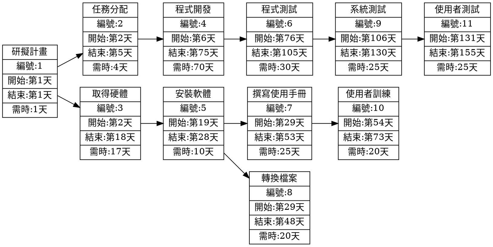

(1)PERT/CPM 圖

## PERT 圖

(2)甘特圖

### 專案關鍵路徑

1. **研擬計畫** (1 天)
2. **任務分配** (4 天)
3. **程式開發** (70 天)
4. **程式測試** (30 天)
5. **系統測試** (25 天)
6. **使用者測試** (25 天)

**總工期：155 天**

(1) 顯示任務及任務模式

(2) 輸入開始及結束時間。

